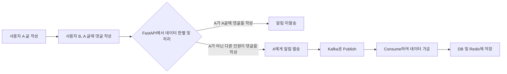
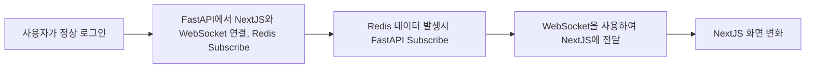

# 📂 목록

- [Minio 구축하기](./minio.md)
- [ClickHouse 구축하기](./clickhouse.md)
- [Redis 구축하기](./reids.md)
- [사용자 알림 및 실시간 데이터 처리](./user_noti.md)

# 사용자 알림 및 실시간 데이터 처리

커뮤니티를 개발하면서 댓글, 좋아요, 팔로워 글 작성 등의 기능에서 사용자에게 알림이 가게 하는 기능이 필요함을 느꼈습니다.  
다행히도 기존에 사용자 방문 통계에 Kafka를 운용하고 있어서, Redis와 WebSocket 정도만 추가하여 수월하게 개발 할 수 있었습니다.

## 처리 흐름

알림에 해당하는 항목이 발생할 경우 요건에 충족하는 사용자에게 알림이 가게 하는 것입니다.    
현재 알림에 해당하는 조건은 아래와 같습니다.

- 내가 팔로우한 작성자가 글 작성
- 내가 쓴 글에 댓글 달린 경우
- 내 댓글에 대댓글이 달린 경우
- 나를 팔로잉한 사람이 발생한 경우
- 운영자 제재가 발생한 경우

내가 쓴 글에 댓글 달린 경우를 기준으로 흐름은 다음과 같습니다.

Kafka에서 처리 방식입니다.



WebSocket의 동작입니다.



## 사용자 알람 테이블 생성

실시간으로도 보여주지만 사용자가 확인하더라도, 7일은 유지하게 하기 위해 생성했습니다.   
여러가지 동작에 대해 데이터 규격을 통일하가 어려워 json으로 만들고 화면에서 변환하여 보여줍니다.

```sql
CREATE TABLE IF NOT EXISTS user_notifications (
    id SERIAL PRIMARY KEY,
    user_email TEXT NOT NULL,
    noti_type TEXT NOT NULL,
    payload JSONB,
    is_read BOOLEAN DEFAULT FALSE,
    created_time TIMESTAMP DEFAULT NOW()
);
COMMENT ON COLUMN user_notifications.id IS '자동 생성 ID';
COMMENT ON COLUMN user_notifications.user_email IS '사용자 이메일';
COMMENT ON COLUMN user_notifications.noti_type IS '알림 타입';
COMMENT ON COLUMN user_notifications.payload IS '알림 내용';
COMMENT ON COLUMN user_notifications.is_read IS '알림 읽기 여부';
COMMENT ON COLUMN user_notifications.created_time IS '알림 생성 시간';
```

## Code 작성

Code를 추가할 부분이 많습니다.

NextJS, FastAPI, Kafka Consumer 전부 추가해야 합니다.

### NextJS

NextJS에서는 WebSocket을 연결하는 부분을 추가합니다.   
useEffect에서 사용자가 로그인을 한 경우에 WebSocket 연결을 진행합니다.   
중복으로 들어오는게 좀 있어서 필터링도 진행합니다.

```js
  useEffect(() => {
    if (!session?.accessToken) return;

    const ws = new WebSocket(
      `wss://${process.env.NEXT_PUBLIC_REDIS_HOST}/ws?token=${session.accessToken}`
    );

    ws.onmessage = (event) => {
      try {
        const parsed = JSON.parse(event.data);

        if (parsed.type === "init") {
          // 초기 알림 → 서버에서 이미 JSON으로 보냈으므로 추가 parsing 불필요
          const initial = parsed.notifications as NotificationDataTypes[];
          setNotifications(initial);
        } else if (parsed.type === "message") {
          const newNotification = parsed.data as NotificationDataTypes;
          setNotifications((prev) => [...prev, newNotification]);
        } else {
          // type 없는 경우
          const newNotification = parsed as NotificationDataTypes;
          setNotifications((prev) => [...prev, newNotification]);
        }
      } catch (e) {
        console.error("알림 데이터 파싱 실패:", e, event.data);
      }
    };

    return () => {
      ws.close();
    };
  }, [session?.accessToken]);
```

### FastAPI

NextJS와 WebSocket을 연결하면서 Redis를 Subscribe 하는 것도 작성해야 합니다. 또한 알림 동작시 Kafka로 Publish도 해야합니다.   
Redis의 키는 사용자의 email정보를 사용합니다. 작성 후 main.py에서 FastAPI의 WebSocket 모듈을 사용하여 연결합니다.

> 하면서 좀 어려웠던게 중복인 데이터가 계속 생기는 문제가 있었는데, 일단 데이터 필터링 하는 방식으로 되어 있습니다.

```python
import asyncio
import json
import os
from typing import Dict, Set
from redis.asyncio import Redis
from fastapi import WebSocket

# Redis 연결
redis = Redis.from_url(f"redis://{os.getenv('REDIS_HOST')}", decode_responses=True)

# WebSocket 연결 저장
connected_websockets: Dict[str, WebSocket] = {}  # user_email -> websocket
user_listeners: Dict[str, asyncio.Task] = {}  # user_email -> listener task
sent_notifications: Dict[str, Set[str]] = {}  # user_email -> 전송한 알림 고유 키


async def websocket_handler(websocket: WebSocket, user_email: str):
    """
    클라이언트 WebSocket 연결 처리
    """
    await websocket.accept()
    connected_websockets[user_email] = websocket

    # --------------------------
    # 1️⃣ 초기 알림 가져오기 + 제거
    # --------------------------
    existing_notifications = []
    while True:
        n = await redis.lpop(f"notifications:{user_email}")
        if not n:
            break
        existing_notifications.append(json.loads(n))  # Redis에는 json.dumps로 저장됨

    # 최신 순서대로 전달
    existing_notifications.reverse()

    await websocket.send_text(
        json.dumps({"type": "init", "notifications": existing_notifications})
    )

    # --------------------------
    # 2️⃣ listener 생성 (없으면)
    # --------------------------
    if user_email not in user_listeners:
        user_listeners[user_email] = asyncio.create_task(redis_listener(user_email))

    try:
        while True:
            # 클라이언트에서 메시지 수신(예: ping용)
            await websocket.receive_text()
    except Exception:
        await cleanup_user(user_email)


async def redis_listener(user_email: str):
    """
    Redis Pub/Sub 구독 및 실시간 알림 전송
    """
    pubsub = redis.pubsub()
    await pubsub.subscribe(f"notifications_channel:{user_email}")

    if user_email not in sent_notifications:
        sent_notifications[user_email] = set()

    try:
        async for message in pubsub.listen():
            if message["type"] != "message":
                continue

            raw_data = message["data"]
            data = json.loads(raw_data)

            # --------------------------
            # 1️⃣ 고유 키 생성 (중복 방지)
            # --------------------------
            notification_key = f"{data['noti_type']}_{data.get('post_id')}_{data.get('parent_comment_id')}_{data.get('author_email')}_{data.get('id')}"

            if notification_key in sent_notifications[user_email]:
                continue

            sent_notifications[user_email].add(notification_key)

            ws = connected_websockets.get(user_email)
            if ws:
                try:
                    # 항상 JSON 문자열로 통일
                    await ws.send_text(json.dumps({"type": "message", "data": data}))
                except Exception:
                    await cleanup_user(user_email)
                    break

    except asyncio.CancelledError:
        pass
    finally:
        await pubsub.unsubscribe(f"notifications_channel:{user_email}")
        await pubsub.close()


async def cleanup_user(user_email: str):
    """
    특정 유저 관련 WebSocket, listener, sent_notifications 정리
    """
    connected_websockets.pop(user_email, None)

    if user_email in user_listeners:
        user_listeners[user_email].cancel()
        await user_listeners.pop(user_email, None)

    sent_notifications.pop(user_email, None)

# main.py
from util.websocket import websocket_handler

@app.websocket("/ws")
async def websocket_endpoint(websocket: WebSocket, token: str = Query(...)):
    """
    로그인한 사용자만 WebSocket 연결
    토큰은 query param으로 전달
    """
    user_email = UserUtil.verify_google_token(token)
    if not user_email:
        await websocket.close(code=1008)  # 정책 위반
        return

    await websocket_handler(websocket, user_email)

# Publish 동작
# 본인이 작성한 거는 무시
if request_info.post_author_email != user_email:
    kafka_message = {
        "url": f"{bigint_post_id}-{request_info.slug}?comment_id={new_id}",
        "author_email": user_email,
        "post_id": bigint_post_id,
        "author_nickname": request_info.nickname,
        "title": request_info.title,
        "noti_type": "create_parent_comment",
    }
    json_str = json.dumps(kafka_message)
    produce_notification(json_str)

# 전송
def produce_notification(value: str):
    producer.produce(
        NOTIFICATION_TOPIC, value=value.encode("utf-8"), callback=delivery_report
    )
    producer.poll(0)
    producer.flush(0.2)
```

### Kafka Consumer

Kafka Consumer 입니다. 여기서는 Consume 후 데이터를 가공하여 Redis와 DB에 적재합니다.

사용자 동작마다 개별로 process를 돌려서 데이터를 가공하고 적재합니다. 또한 쿼리도 전부 다르게 사용합니다. 

> 여기가 조금 복잡합니다. 한 번 놓치면 엉켜버립니다.

```python
import json
import redis
from consumer.pg_client import get_pg_connection
from consumer.logger import logger
import os
from dotenv import load_dotenv

load_dotenv()
pg_conn = get_pg_connection()
logger.info("알림 DB 연결 성공")

# Redis 연결
redis_client = redis.StrictRedis(
    host=os.getenv("REDIS_HOST"),
    port=int(os.getenv("REDIS_PORT")),
    db=int(os.getenv("REDIS_DB")),
    decode_responses=True,
)
logger.info("Redis 연결 성공")

NOTIFICATION_HANDLERS = {
    "create_post": {
        "query": """
            INSERT INTO user_notifications (user_email, noti_type, payload)
            SELECT uf.following_email, %(noti_type)s, %(payload)s
            FROM user_follows uf
            WHERE uf.follower_email = %(author_email)s
            RETURNING user_email
        """,
        "param_builder": lambda data: {
            "noti_type": data["noti_type"],
            "payload": json.dumps(data),
            "author_email": data["author_email"],
        },
    },
    "create_parent_comment": {
        "query": """
            INSERT INTO user_notifications (user_email, noti_type, payload)
            SELECT cp.user_email, %(noti_type)s, %(payload)s
            FROM community_posts cp
            WHERE cp.id = %(post_id)s
            RETURNING user_email
        """,
        "param_builder": lambda data: {
            "noti_type": data["noti_type"],
            "payload": json.dumps(data),
            "post_id": data["post_id"],
        },
    },
    "create_child_comment": {
        "query": """
            INSERT INTO user_notifications (user_email, noti_type, payload)
            SELECT cc.user_email, %(noti_type)s, %(payload)s
            FROM community_comments cc
            WHERE cc.id = %(parent_comment_id)s
            RETURNING user_email
        """,
        "param_builder": lambda data: {
            "noti_type": data["noti_type"],
            "payload": json.dumps(data),
            "parent_comment_id": data["parent_comment_id"],
        },
    },
    "follow_user": {
        "query": """
            INSERT INTO user_notifications (user_email, noti_type, payload)
            SELECT ui.email, %(noti_type)s, %(payload)s
            FROM user_info ui
            WHERE ui.email = %(follower_email)s
            RETURNING user_email
        """,
        "param_builder": lambda data: {
            "noti_type": data["noti_type"],
            "payload": json.dumps(data),
            "follower_email": data["follower_email"],
        },
    },
    "penalty_user": {
        "query": """
            INSERT INTO user_notifications (user_email, noti_type, payload)
            VALUES (%(user_email)s, %(noti_type)s, %(payload)s)
            RETURNING user_email
        """,
        "param_builder": lambda data: {
            "user_email": data["user_email"],
            "noti_type": data["noti_type"],
            "payload": json.dumps(data),
        },
    },
}


def save_notifications_and_push_to_redis(cur, query, params, data):
    """
    공통 함수: DB에 알림 저장 후 Redis에 push
    """
    cur.execute(query, params)
    notified_users = [row[0] for row in cur.fetchall()]
    pg_conn.commit()

    for user_email in notified_users:
        redis_key = f"notifications:{user_email}"
        redis_client.lpush(redis_key, json.dumps(data))
        redis_client.expire(redis_key, 60 * 60 * 24 * 7)  # TTL 7일
        # ✅ WebSocket용 pub/sub push
        redis_client.publish(f"notifications_channel:{user_email}", json.dumps(data))

    return notified_users


def process_notification_message(data):
    """
    알림 처리하기
    """
    handler = NOTIFICATION_HANDLERS.get(data["noti_type"])
    if not handler:
        logger.warning(f"지원하지 않는 알림 타입: {data['noti_type']}")
        return

    try:
        with pg_conn.cursor() as cur:
            insert_query = handler["query"]
            params = handler["param_builder"](data)
            save_notifications_and_push_to_redis(cur, insert_query, params, data)
        logger.info(f"알림 처리 완료: {data} (Redis Save)")
    except Exception as e:
        logger.error(f"알림 처리 실패: {e}")
        pg_conn.rollback()

```

## 결과

이제 아이디 2개를 사용하여 연결이 잘 되었나 확인해보면 됩니다.
https://github.com/user-attachments/assets/dce64424-9cb4-4edd-b95f-2818ad41037a


