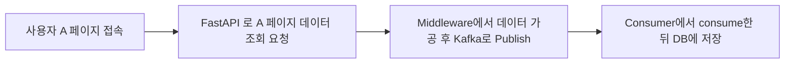

# 📂 목록

- [Minio 구축하기](./minio.md)
- [ClickHouse 구축하기](./clickhouse.md)
- [Redis 구축하기](./reids.md)
- [사용자 알림 및 실시간 데이터 처리](./user_noti.md)

# 사용자 알림 및 실시간 데이터 처리

커뮤니티를 개발하면서 댓글, 좋아요, 팔로워 글 작성 등의 기능에서 사용자에게 알림이 가게 하는 기능이 필요함을 느꼈습니다.  
다행히도 기존에 사용자 방문 통계에 Kafka를 운용하고 있어서, Redis와 WebSocket 정도만 추가하여 수월하게 개발 할 수 있었습니다.

# 처리 흐름

알림에 해당하는 항목이 발생할 경우 요건에 충족하는 사용자에게 알림이 가게 하는 것입니다.    
현재 알림에 해당하는 조건은 아래와 같습니다.

- 내가 팔로우한 작성자가 글 작성
- 내가 쓴 글에 댓글 달린 경우
- 내 댓글에 대댓글이 달린 경우
- 나를 팔로잉한 사람이 발생한 경우
- 운영자 제재가 발생한 경우

흐름은 다음과 같습니다.

간단합니다. Publish할 때 Data 규격만 통일하면 수월하게 사용할 수 있습니다.
