# 📂 목록

- 🛠️ [Kafka 환경 구축](./kafka_system_development.md)
- 🚀 [ClickHouse와 PostgreSQL 비교 및 테이블 설계](./clickhouse_postgresql.md)
- [사용자 방문 통계](./user_footprint.md)


# 사용자 방문 통계

사용자 방문 통계는 말 그대로 인증/미인증 사용자가 어떤 페이지를 접속했는지를 전부 수집하여 계산합니다.  

흐름은 다음과 같습니다.

```mermaid
graph LR
A[사용자 A 페이지 접속] --> B[FastAPI 로 A 페이지 데이터 조회 요청] --> C[Middleware에서 데이터 가공 후 Kafka로 Publish] --> D[Consumer에서 consume한 뒤 DB에 저장]
```



간단합니다. Publish할 때 Data 규격만 통일하면 수월하게 사용할 수 있습니다.

## 사용자 방문 통계 Table

사용자 방문 통계 Table 정보입니다.  
사용자 흔적이라는 의미에서 user_footprint로 만들었습니다. ㅎㅎ ~~만들고 보니 어색합니다.~~

초기에는 IP도 수집을 하고 싶었는데, Nginx Proxy Manager와 CloudFlare를 거쳐서 들어오다 보니 전부 통일이 되어서 포기했습니다.

```sql
CREATE TABLE IF NOT EXISTS USER_FOOTPRINT
(
  ID SERIAL PRIMARY KEY,
  LINK TEXT,
  REQUEST TEXT,
  FOOTPRINT_TIME timestamp with time zone,
  EXECUTE_TIME timestamp with time zone default now()
);
COMMENT ON COLUMN USER_FOOTPRINT.ID IS '자동 생성 아이디';
COMMENT ON COLUMN USER_FOOTPRINT.REQUEST IS '요청 타입';
COMMENT ON COLUMN USER_FOOTPRINT.LINK IS '방문 주소';
COMMENT ON COLUMN USER_FOOTPRINT.FOOTPRINT_TIME IS '전송 시간';
COMMENT ON COLUMN USER_FOOTPRINT.EXECUTE_TIME IS '적재 시간';
```

## Code 작성

Front는 수정사항이 없습니다. Back에서 Middleware를 사용하여 중간 과정을 넣는 것이기 때문입니다.   
Table의 규격에 맞게 보내면 나머지는 Consumer에서 처리합니다.

### Backend Code

해당 코드를 작성한 후 main.py에 import 하면 됩니다.

```python
# middleware.py
import json
from datetime import datetime
from zoneinfo import ZoneInfo
from starlette.middleware.base import BaseHTTPMiddleware
from util.kafka_producer import produce_message


class KafkaProducerMiddleware(BaseHTTPMiddleware):
    async def dispatch(self, request, call_next):
        now_kst = datetime.now(ZoneInfo("Asia/Seoul"))
        footprint_time = now_kst.isoformat()
        data = {
            "method": request.method,
            "link": request.url.path,
            "footprint_time": footprint_time,
        }
        json_str = json.dumps(data)
        produce_message(json_str)
        response = await call_next(request)
        for header in ("x-frame-options", "X-Frame-Options"):
            if header in response.headers:
                del response.headers[header]

        return response

# main.py
from util.middleware import KafkaProducerMiddleware

app.add_middleware(KafkaProducerMiddleware)
```

### Consumer Code

Python을 사용해서 Consumer를 새로 만들었습니다.    
Kafka Topic에 연결한 후, consume한 뒤 DB에 넣는 과정입니다.  

주요한 부분만 올립니다. 자세한 것은 [Git Project](https://github.com/eft-library/eft-library-kafka)에서 확인하실 수 있습니다.

```python
# Consume 동작의 기본이 되는 함수 입니다. Config를 매개변수로 받아 해당 topic에 연결 후 대기 합니다.
# Message가 들어오면 매개변수로 받은 callback 함수를 사용하여 가공 후 DB에 적재를 진행합니다.
import json
from confluent_kafka import Consumer, KafkaError
from consumer.logger import logger


def run_consumer(kafka_config, process_message_callback):
    consumer = Consumer(
        {
            "bootstrap.servers": kafka_config["bootstrap.servers"],
            "group.id": kafka_config["group.id"],
            "auto.offset.reset": kafka_config["auto.offset.reset"],
        }
    )
    topic = kafka_config["topic"]
    consumer.subscribe([topic])
    logger.info(f"Subscribed to topic: {topic}")

    try:
        while True:
            msg = consumer.poll(1.0)
            if msg is None:
                continue
            if msg.error():
                if msg.error().code() == KafkaError._PARTITION_EOF:
                    logger.warning(
                        f"End of partition: {msg.topic()} [{msg.partition()}]"
                    )
                else:
                    logger.error(f"Kafka error: {msg.error().str()}")
                continue

            try:
                data = json.loads(msg.value().decode("utf-8"))
                logger.info(f"Received message JSON: {data}")

                process_message_callback(data)

            except json.JSONDecodeError as e:
                logger.error(f"JSON 디코딩 실패: {e}")
            except Exception as e:
                logger.error(f"메시지 처리 실패: {e}")

    except KeyboardInterrupt:
        logger.info("Consumer 종료됨")
    finally:
        consumer.close()
        logger.info("Consumer 연결 종료")


# 적재 함수입니다. 적재시간은 auto라서 나머지 정보만 넣어줍니다.
def save_log_to_postgresql(conn, data):
    with conn.cursor() as cur:
        insert_query = """
        INSERT INTO user_footprint (request, link, footprint_time)
        VALUES (%s, %s, %s)
        """
        cur.execute(
            insert_query, (data["method"], data["link"], data["footprint_time"])
        )
    conn.commit()
    logger.info("데이터 PostgreSQL 저장 완료")
```

## 결과

사용자가 방문하면 consumer log에도 남고 DB에도 저장되는 것을 확인할 수 있습니다.


그리고 이렇게 수집한 결과를 사용하여 사이트 통계를 만들고 있습니다.


